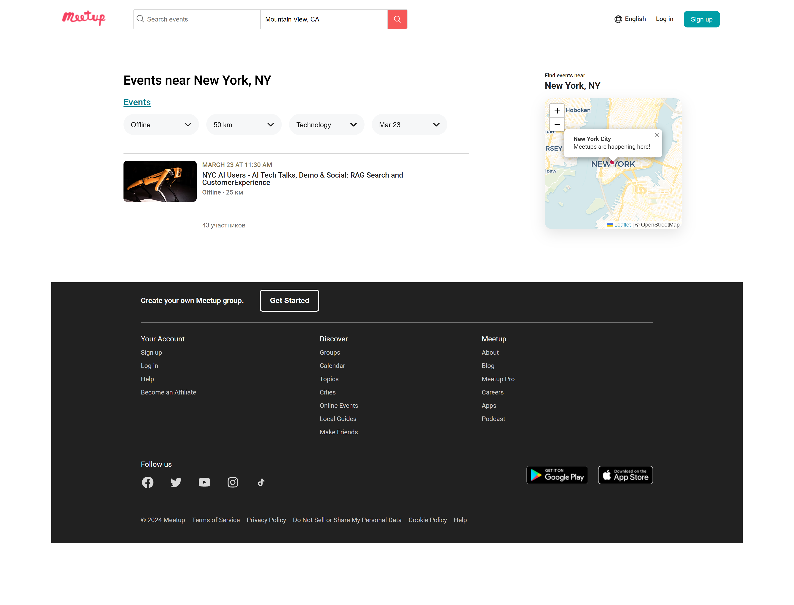
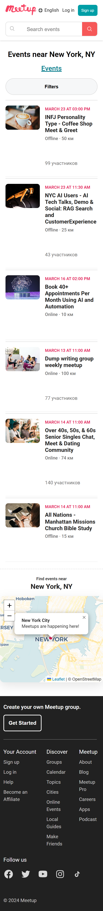

## Screenshots

### Desktop Version

### Filtering & Maps

### Mobile Responsive Design

---

# 🌍 Events-Plattform Projekt

Eine interaktive Web-Anwendung zur Suche und Filterung von Veranstaltungen in New York. Dieses Projekt wurde als Abschlussarbeit entwickelt und demonstriert moderne Front-End-Entwicklungsfähigkeiten sowie den Umgang mit dynamischen Daten.

## 🚀 Hauptfunktionen
- **Interaktive Karte**: Integration der Leaflet.js-Bibliothek zur Visualisierung von Standorten.
- **Intelligentes Filtersystem**: Suche nach Veranstaltungen basierend auf Kategorie, Entfernung, Typ (Online/Offline) und Datum.
- **Responsive Design**: Vollständig optimiert für eine korrekte Darstellung auf allen Geräten und Bildschirmgrößen.
- **Dynamisches Rendering**: Veranstaltungskarten werden automatisch aus einem JavaScript-Daten-Array generiert.

## 🛠 Technologien
- **HTML5**: Semantische Struktur.
- **CSS3**: Flexbox, Grid, Google Fonts (Roboto).
- **JavaScript (ES6+)**: Filterlogik und DOM-Manipulation.
- **Leaflet API**: Interaktive Karten.

## 📦 Installation und Start
1. Laden Sie das Repository herunter oder klonen Sie es.
2. Öffnen Sie die `index.html` im Browser (die Verwendung der VS Code Erweiterung **Live Server** wird empfohlen).

---
---

# 🌍 Events Platform Project

An interactive web application for searching and filtering events in New York. This project was developed as a final assignment, demonstrating modern front-end development skills and dynamic data handling.

## 🚀 Key Features
- **Interactive Map**: Integrated Leaflet.js library for location visualization.
- **Smart Filtering System**: Search events by category, distance, type (Online/Offline), and date.
- **Responsive Design**: Fully optimized for a seamless experience across all devices and screen sizes.
- **Dynamic Rendering**: Event cards are automatically generated from a JavaScript data array (eventsStore).

## 🛠 Tech Stack
- **HTML5**: Semantic markup.
- **CSS3**: Flexbox, Grid, Google Fonts (Roboto).
- **JavaScript (ES6+)**: Filtering logic and DOM manipulation.
- **Leaflet API**: Interactive maps.

## 📦 How to Run
1. Clone or download the repository.
2. Open `index.html` in your browser (using the VS Code **Live Server** extension is recommended).

---
---

# 🌍 Events Platform Project

Интерактивная платформа для поиска и фильтрации мероприятий. Проект выполнен в рамках финальной аттестации, демонстрирует навыки создания современных интерфейсов и работы с динамическими данными.

## 🚀 Основной функционал
- **Интерактивная карта**: Реализована интеграция с библиотекой Leaflet для визуализации локаций.
- **Система фильтрации**: Умный поиск мероприятий по категориям, дистанции, типу (Online/Offline) и дате.
- **Адаптивная верстка**: Интерфейс полностью оптимизирован для корректного отображения на любых устройствах и размерах экранов.
- **Динамический рендеринг**: Автоматическая генерация карточек событий из JavaScript-массива данных.

## 🛠 Стек технологий
- **HTML5** (Семантическая верстка)
- **CSS3** (Flexbox, Grid, Google Fonts)
- **JavaScript ES6+** (Логика фильтров, манипуляция DOM)
- **Leaflet API** (Картография)

## 📦 Инструкция по запуску
1. Склонируйте или скачайте репозиторий.
2. Откройте `index.html` в браузере (рекомендуется использовать расширение VS Code **Live Server** для корректной работы всех скриптов).

